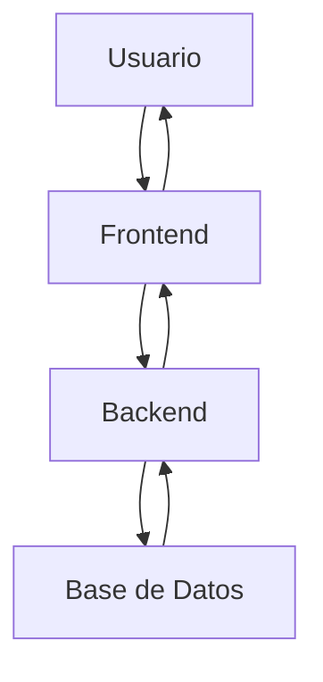

# 📚 Lectura 1 – ¿Esto es una web o una app web?

Para entender la diferencia entre un sitio web y una aplicación web, hay que pensar en ellos como un libro y un videojuego. Un libro (sitio web) da información para leer, mientras que un videojuego (aplicación web) que nos permite interactuar y hacer cosas.

## 1. Ejemplos de Sitios Web Informativos

Aquí hay 3 ejemplos de sitios web informativos:

- **Gizmodo**: Un sitio web de noticias y cultura enfocado en tecnología, diseño, ciencia y ciencia ficción.
- **Xataka**: Un portal de noticias, análisis y reportajes sobre tecnología, especializado para mantenernos al día con las últimas novedades del sector.
- **Enciclopedia Wix**: Un recurso educativo de Wix que explica conceptos de desarrollo web, marketing digital y funcionalidades de su plataforma. Sirve como una colección de guías y artículos para ayudarnos a los usuarios a entender y utilizar mejor sus herramientas.

## 2. Ejemplos de Aplicaciones Web

Aquí hay 3 ejemplos de aplicaciones web:

- **Google Docs**: Un procesador de texto en línea que nos permite crear, editar y compartir documentos en tiempo real.
- **Canva**: Una herramienta de diseño gráfico en línea para que podamos crear presentaciones, pósters, redes sociales y más.
- **Netflix**: Un servicio de streaming que nos permite seleccionar, reproducir y gestionar contenido multimedia.

## 3. Clasificación

**Sitios Web Informativos**: Los ejemplos mencionados son principalmente para consumir información. Su función principal es mostrarnos contenido estático o semi-estático. Aunque pueden tener elementos interactivos menores (como barras de búsqueda o formularios de contacto), no nos ofrecen funcionalidades complejas que nos permitan al usuario manipular datos o interactuar con el sistema de forma significativa.

**Aplicaciones Web**: Los ejemplos de aplicaciones web están diseñados para la interacción y la manipulación de datos. Nos permiten a los usuarios crear contenido, colaborar, gestionar información, y realizar acciones que cambian el estado de la aplicación. En lugar de solo leer, como usuario "hacemos" cosas.

## 4. ¿Qué hace que una aplicación web sea interactiva? ¿Qué tecnologías podrían estar detrás?

Una aplicación web es interactiva porque nos permite una comunicación bidireccional constante entre el usuario y el servidor. No solo nos muestra información, sino que responde a las acciones de nosotros como usuario, actualiza el contenido dinámicamente y permite la manipulación de datos.

Las tecnologías principales que hacen posible esta interactividad son:

### Frontend (lado del cliente):
- **HTML**: Estructura el contenido.
- **CSS**: Estiliza la apariencia.
- **JavaScript**: Es el motor de la interactividad. Nos permite que la página web responda a clics, enviar formularios, arrastrar y soltar, animaciones y solicitudes de datos al servidor sin recargar la página completa. Frameworks y librerías como React, Angular y Vue.js potencian aún más esta interactividad, facilitando la creación de interfaces de usuario complejas y dinámicas.

### Backend (lado del servidor):
- **Lenguajes de programación**: Como Python (Django, Flask), Node.js (Express), Ruby (Ruby on Rails), PHP (Laravel), Java (Spring), etc. Estos lenguajes procesan nuestras solicitudes como usuario, e interactúan con la base de datos y envían los datos necesarios al frontend.
- **APIs** (Application Programming Interfaces): Nos permiten la comunicación estructurada entre el frontend y el backend.

### Bases de Datos:
- **SQL** (PostgreSQL, MySQL, SQL Server): Para datos estructurados.
- **NoSQL** (MongoDB, Cassandra): Para datos más flexibles y escalables. Almacenan y gestionan la información que la aplicación necesita para funcionar, permitiendo que los datos sean persistentes y estén disponibles para todos los usuarios.

---

# 📚 Lectura 2 – Anatomía de una aplicación web moderna

## 1. Conceptos

**Frontend**: Es la parte de la aplicación web con la que el usuario interactúa directamente. Pensando en todo lo que vemos y cliqueamos en una página web: los botones, las imágenes, el texto, los formularios. Se construye con HTML (estructura), CSS (estilo) y JavaScript (interactividad). El objetivo es presentar la información de manera atractiva y permitir que el usuario realice acciones.

**Backend**: Es el "cerebro" de la aplicación, la parte que no se ve. Se encarga de la lógica de negocio, el procesamiento de datos, la autenticación de usuarios y la comunicación con la base de datos. Cuando haces clic en un botón en el frontend (como "Guardar"), es el backend el que recibe esa solicitud, la procesa y realiza la acción correspondiente. Se construye con lenguajes como Python, Node.js, Java, PHP, Ruby, entre otros, y frameworks que facilitan su desarrollo.

**Base de datos**: Es donde se almacena toda la información de la aplicación de forma organizada y persistente. Puede ser desde los datos de los usuarios, sus publicaciones, configuraciones, productos, etc. El backend se comunica con la base de datos para guardar, recuperar, actualizar o eliminar información según las necesidades de la aplicación.

## 2. Diagrama de Comunicación (Mermaid)



---

# 📚 Lectura 3 – Explorando las herramientas de desarrollo

## 1. Cómo abrir DevTools

Para abrir las DevTools en el navegador:
- **Windows**: Presiona F12 o Ctrl + Shift + I
- **Linux**: Presiona Ctrl + Shift + I
- **Mac**: Presiona Cmd + Option + I

## 2. Explorando las Pestañas

**Elementos (Elements)**: Muestra la estructura HTML de la página y los estilos CSS aplicados a cada elemento. Se puede inspeccionar y modificar el HTML y CSS en tiempo real para ver cómo afectan la apariencia de la página.

**Consola (Console)**: Muestra mensajes de error, advertencias y logs de JavaScript. Es una herramienta esencial para depurar el código JavaScript y entender qué está pasando en la aplicación.

**Red (Network)**: Registra todas las solicitudes y respuestas HTTP que hace el navegador al cargar una página (imágenes, scripts, estilos, datos de API). Permite ver el tiempo de carga, el tamaño de los recursos y los códigos de estado HTTP.

**Almacenamiento (Storage)**: Permite inspeccionar y gestionar el almacenamiento local del navegador, incluyendo Cookies, Local Storage, Session Storage e IndexedDB. Aquí se guardan datos que la web necesita recordar entre sesiones o para un funcionamiento offline.

## 3. Inspección en Google.com

Para realizar esta actividad, abre Google.com y luego las DevTools.

### Una solicitud HTTP (en la pestaña "Network"):
- Se abre la pestaña Network.
- Se actualiza la página (F5 o Cmd/Ctrl + R).
- Veremos una lista de todas las solicitudes. Buscamos una línea que diga Name: www.google.com (o similar) con el Type: document. Esta es la solicitud principal para cargar la página. Hacemos clic en ella y vamos a la pestaña Headers para ver los detalles de la solicitud y la respuesta.

### Un error en consola (si aparece):
- Abre la pestaña Console.
- En Google.com, es posible que no veas errores graves. Podrías ver algunas advertencias o mensajes informativos si el sitio los ha programado. Si quieres forzar un error, puedes escribir algo como `console.error("Esto es un error de prueba");` y presionar Enter para que aparezca.

### El HTML de un elemento (en la pestaña "Elements"):
- Abre la pestaña Elements.
- Haz clic derecho sobre la barra de búsqueda de Google y selecciona "Inspect" (Inspeccionar).
- Verás cómo se resalta el código HTML correspondiente a la barra de búsqueda en la pestaña "Elements". Por ejemplo, podrías ver un elemento `<textarea>` o `<input>` con un atributo `name="q"`.

---

# 📚 Lectura 4 – Soy nuevo y aprendí Java… ¿y ahora qué con HTML, CSS y JS?

¡Genial que ya tengamos conocimientos de Java! Eso nos da una base sólida para entender la programación. Ahora, vamos a ver cómo HTML, CSS y JavaScript encajan en el mundo del desarrollo web, especialmente en el frontend, que es lo que el usuario ve y con lo que interactúa en su navegador.

## 1. ¿Qué hace cada tecnología en una web?

Imagina una página web como una casa:

### HTML (HyperText Markup Language):
Es el esqueleto o la estructura de la casa. Define dónde están las paredes, las habitaciones, las ventanas y las puertas. En una web, HTML es responsable de la estructura del contenido. Usa "etiquetas" (como `<h1>` para un título, `<p>` para un párrafo, `` para una imagen, `<button>` para un botón) para organizar el texto, las imágenes, los videos y otros elementos. Sin HTML, solo tendrías texto sin formato.

```html
<h1>Bienvenido a mi web</h1>
<p>Este es un párrafo de texto.</p>
<button>Haz clic aquí</button>
```

### CSS (Cascading Style Sheets):
Es la decoración y el diseño de la casa: el color de las paredes, el tipo de muebles, cómo se ven las cortinas. CSS se encarga de la presentación y el estilo visual de los elementos HTML. Permite cambiar colores, fuentes, tamaños, espaciado, diseño (cómo se organizan los elementos en la pantalla), animaciones y mucho más. Hace que la web sea atractiva y fácil de usar.

```css
/* Ejemplo simple de CSS */
h1 {
    color: blue;
    font-family: Arial, sans-serif;
}
p {
    font-size: 16px;
    line-height: 1.5;
}
button {
    background-color: green;
    color: white;
    padding: 10px 20px;
    border: none;
}
```

### JavaScript (JS):
Es la funcionalidad y la interactividad de la casa: el interruptor de la luz que enciende las bombillas, la puerta que se abre cuando empujas, el sistema de seguridad que detecta movimiento. JavaScript es el lenguaje de programación del navegador web. Permite que las páginas web sean dinámicas e interactivas. Con JS, puedes:
- Responder a los clics del usuario (por ejemplo, mostrar un mensaje al hacer clic en un botón).
- Cambiar el contenido de la página sin recargarla.
- Validar formularios antes de enviarlos.
- Crear animaciones complejas.
- Comunicarse con un servidor para obtener o enviar datos (lo que hace que una "web" se convierta en una "app web").

```javascript
// Ejemplo simple de JavaScript
document.querySelector('button').addEventListener('click', function() {
    alert('¡Hiciste clic en el botón!');
});
```

## 2. Comparación breve entre Java y JavaScript

Aunque sus nombres son similares, Java y JavaScript son dos lenguajes de programación distintos con propósitos y ecosistemas diferentes.

### ¿En qué se parecen?
- Ambos son lenguajes de programación de alto nivel, lo que significa que son más cercanos al lenguaje humano que al código máquina.
- Ambos son orientados a objetos (aunque JavaScript también es multi-paradigma).
- Ambos tienen sintaxis C-like, lo que significa que utilizan llaves {} para bloques de código y punto y coma ; para terminar sentencias, haciendo que sus estructuras se vean superficialmente similares.

### ¿En qué se diferencian?

| Característica | Java | JavaScript |
|---|---|---|
| **Tipo** | Lenguaje de propósito general, compilado. | Lenguaje de scripting, interpretado (en el navegador). |
| **Ejecución** | En la Java Virtual Machine (JVM). | Principalmente en navegadores web (motor V8, SpiderMonkey) o en el servidor con Node.js. |
| **Tipado** | Estáticamente tipado (fuerte). | Dinámicamente tipado (débil). |
| **Uso Principal** | Aplicaciones de escritorio, empresariales, Android, backend web. | Desarrollo frontend web, backend con Node.js, apps móviles (React Native), IoT. |
| **Empresa (Histórica)** | Sun Microsystems (ahora Oracle). | Netscape Communications (originalmente LiveScript). |

## 3. README: Fundamentos de Desarrollo Web Frontend

### 🏗️ HTML: El Esqueleto de la Web

**HTML** (HyperText Markup Language) no es un lenguaje de programación, sino un **lenguaje de marcado**. Piensa en él como los planos de una casa o el esqueleto de un cuerpo. Su única función es **estructurar el contenido** de una página web.

Imagina que quieres mostrar un título, un párrafo y una imagen. Con HTML, usarías etiquetas como:

```html
<!DOCTYPE html>
<html lang="es">
<head>
    <meta charset="UTF-8">
    <title>Mi Primera Web</title>
</head>
<body>
    <h1>¡Hola, Mundo Web!</h1>
    <p>Esta es una introducción a HTML.</p>
    
</body>
</html>
```

Cada etiqueta tiene un propósito y ayuda al navegador a entender qué tipo de contenido está mostrando.

### 🎨 CSS: El Estilo de la Web

Una vez que tienes la estructura con HTML, necesitas hacer que se vea bien. Ahí es donde entra CSS (Cascading Style Sheets). CSS es el "diseñador" de la web. Se encarga de la apariencia visual de tu contenido HTML.

Con CSS puedes controlar:
- Colores de texto y fondo
- Fuentes (tipos, tamaños)
- Márgenes y rellenos
- Posicionamiento de elementos
- Animaciones y transiciones
- Diseños responsivos (para que la web se vea bien en celulares, tablets, etc.)

Por ejemplo, para que tu título `<h1>` sea azul y tu párrafo `<p>` tenga un tamaño de fuente específico, usarías CSS así:

```css
/* Esto se enlazaría a tu archivo HTML */
h1 {
    color: #3498db; /* Azul */
    text-align: center;
}

p {
    font-size: 18px;
    line-height: 1.6;
    margin: 20px;
}
```

Con CSS, transformas una página básica en una interfaz atractiva y profesional.

### ⚡ JavaScript: La Inteligencia de la Web

Mientras que HTML te da la estructura y CSS el estilo, JavaScript (JS) es lo que hace que tu página web sea interactiva y dinámica. Es el lenguaje de programación que corre directamente en el navegador de tus usuarios.

Con JavaScript, puedes:
- Responder a los clics de los botones o movimientos del ratón.
- Modificar el contenido HTML y CSS en tiempo real.
- Validar formularios antes de que se envíen.
- Crear galerías de imágenes interactivas o juegos.
- Comunicarse con servidores (lo que llamamos el "backend") para enviar y recibir datos sin recargar la página.

Un ejemplo sencillo de JavaScript:

```javascript
// Esto iría en un archivo .js o dentro de tu HTML en una etiqueta <script>
document.querySelector('h1').addEventListener('click', function() {
    alert('¡Hiciste clic en el título!');
});

// También puedes cambiar estilos con JS
document.querySelector('p').style.color = 'red';
```

JavaScript es lo que convierte una página estática en una aplicación web completa.

### 💡 Java vs. JavaScript: No son lo mismo

A pesar de sus nombres similares, Java y JavaScript son tan diferentes como un "coche" y una "casa".

- **Java** es un lenguaje compilado, robusto y se usa mucho para aplicaciones de servidor (backend), aplicaciones Android y sistemas empresariales. Es como el motor potente que maneja toda la lógica compleja detrás de escena.

- **JavaScript** es un lenguaje interpretado (principalmente en el navegador) y es el rey del frontend. Su objetivo es hacer que las interfaces de usuario sean dinámicas y respondan a las acciones del usuario. También puede usarse en el backend con Node.js, lo que le permite manejar tanto la parte del cliente como la del servidor.

Si ya conocemos Java, tenemos una gran ventaja porque entendemos conceptos de programación. Ahora, ¡preparémonos para aprender cómo hacer que esas ideas cobren vida en el navegador con HTML, CSS y JavaScript!